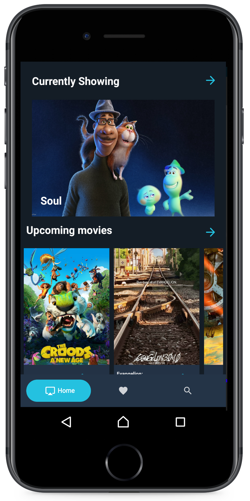
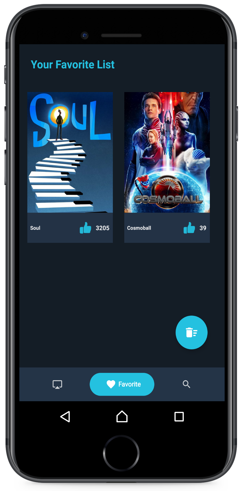
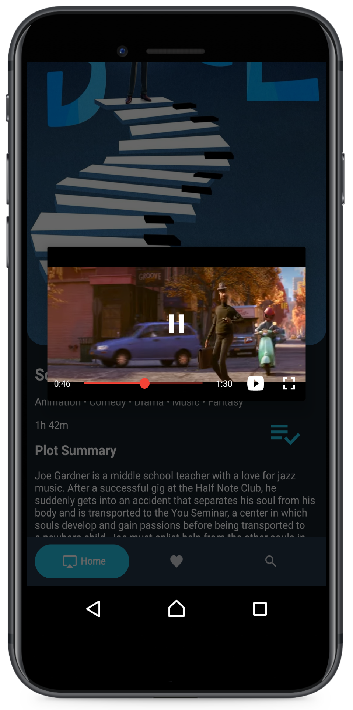

# Filme

Android Movie App for displaying all popular movies, search any movie, find information about it and save it locally as a favourite movie

## Libraries included in this project

* Room (Android Architecture Components)
* Data Binding (Android Architecture Components)
* Live Data (Android Architecture Components)
* ViewModel (Android Architecture Components)
* Glide
* Retrofit
* RecyclerView
* CardView

# Screen Shots

## screen1   secreen2 

## screen3   screen4 

## screen5   screen6 

## Authors

* **Islam Elhady** - *LinkedIn* - [Islam Elhady](https://www.linkedin.com/in/islamelhady)
